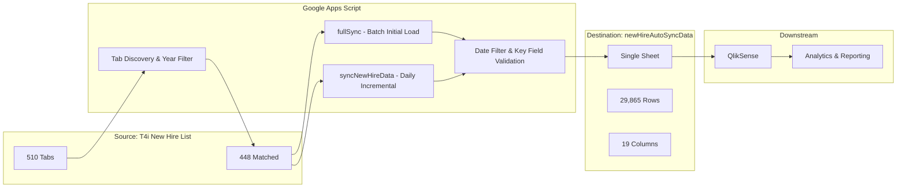

# T4i New Hire Data Sync

**Automated data pipeline that consolidates T4i new hire onboarding records from a 510-tab Google Spreadsheet into a single, clean, QlikSense-ready sheet — updated twice daily.**

---

## Problem Statement

The T4i team tracks new hire onboarding in a shared Google Spreadsheet called **T4i New Hire List**. Over the years, this spreadsheet has grown to **510 tabs** (one per week/category since 2020), making it nearly impossible to:

- Get a unified view of all new hire data
- Load the data into analytics tools like QlikSense
- Track trends across time periods
- Maintain data quality and consistency

Manual consolidation was error-prone, time-consuming, and unsustainable at scale.

## Solution

A Google Apps Script automation that:

1. Scans all 510 source tabs, identifies which ones contain relevant columns
2. Extracts and normalizes data into a consistent 19-column format
3. Filters out empty/invalid rows and future-dated entries
4. Writes everything to a single destination sheet, sorted by Start Date
5. Runs automatically twice daily via time-based triggers

## Architecture

## Key Features

| Feature | Description |
|---------|-------------|
| **Batch Full Sync** | Processes all 448 matching tabs in batches of 150, with auto-continuation triggers. Handles the initial historical data load without hitting execution time limits. |
| **Incremental Daily Sync** | Only re-processes tabs from the last 6 weeks. Preserves historical data already in the destination. Completes in 1-2 minutes. |
| **Smart Tab Detection** | Parses year from tab names (e.g., "Week of Jan 11 21" → 2021). Skips tabs before `EARLIEST_YEAR`. Tabs without parseable years are included as a safety net. |
| **Data-Level Date Filter** | Skips rows where all available dates are in the future (not yet actionable). Also filters out rows with dates before `EARLIEST_YEAR`. |
| **Key Field Validation** | Requires at least one of: First Name, Last Name, Full Name, Username, Start Date, or Ship Date to be non-empty. Eliminates blank/junk rows. |
| **Duplicate Detection** | Tracks potential duplicates using Full Name + Start Date + Hire Type. Reports duplicate groups in the execution log. |
| **Source Tab Tracking** | Appends a "Source Tab" column to every row, enabling traceability back to the original source tab. |
| **QlikSense-Ready Output** | Frozen header row, consistent date formatting (M/d/yyyy), single-sheet layout optimized for direct QlikSense loading. |

## Column Specification

The destination sheet contains 19 columns in the following custom order:

| # | Column Name | Type | Notes |
|---|-------------|------|-------|
| 1 | Start Date | Date (M/d/yyyy) | Primary sort key |
| 2 | Ship Date (t4i use only) | Date (M/d/yyyy) | Secondary sort key |
| 3 | First Name | Text | Key field |
| 4 | Last Name | Text | Key field |
| 5 | Full name (do not fill) | Text | Key field; missing in tabs after Oct 2024 |
| 6 | Username | Text | Key field |
| 7 | SNOW Ticket | Text | ServiceNow ticket reference |
| 8 | Hire Type | Text | Used in duplicate detection |
| 9 | Intuit Email | Text | Missing in tabs after Oct 2024 |
| 10 | Hardware Type: Coder Mac/PC, Pro Mac/PC | Text | Hardware specification |
| 11 | TA Notes | Text | Talent Acquisition notes |
| 12 | Tech Notes | Text | Technical notes |
| 13 | Who is working it | Text | Assigned technician |
| 14 | Provisioned by | Text | Provisioning technician |
| 15 | Shipped | Text | Shipment status |
| 16 | Asset Tag | Text | Hardware asset tag |
| 17 | Tracking number (laptop/full kit) | Text | Shipping tracking number |
| 18 | On Site Location | Text | Physical location |
| 19 | Source Tab | Text | Auto-generated: name of the source tab |

## Configuration

Located at the top of `Code.gs`:

| Variable | Default | Description |
|----------|---------|-------------|
| `SOURCE_SPREADSHEET_ID` | `1cAlD...ZNwU` | ID of the T4i New Hire List spreadsheet |
| `DEST_SPREADSHEET_ID` | `1mt2t...xbw` | ID of the newHireAutoSyncData spreadsheet |
| `EARLIEST_YEAR` | `2021` | Only process tabs/data from this year onward |
| `BATCH_SIZE` | `150` | Number of tabs to process per fullSync batch |
| `LOOKBACK_WEEKS` | `6` | How many weeks back the daily incremental sync looks |

## Function Reference

| Function | Purpose | When to Use |
|----------|---------|-------------|
| `fullSync()` | Batch-processes all historical tabs from `EARLIEST_YEAR`. Auto-continues with 1-min triggers. | Run once for initial data load. Re-run after `resetFullSync()` if needed. |
| `syncNewHireData()` | Incremental sync: refreshes only recent tabs (last `LOOKBACK_WEEKS` weeks), preserves historical data. | Daily auto-trigger (6am + 8pm ET). Can also run manually. |
| `discoverTabs()` | Scans source spreadsheet and reports which tabs match the target columns. | Run when tabs are added/removed/renamed in the source. |
| `runSortAndFormat()` | Sorts existing destination data by Start Date/Ship Date and applies date formatting. | Run if data needs re-sorting after manual edits. |
| `cleanupOldData()` | Removes rows with dates before `EARLIEST_YEAR` from the destination. | Run after fullSync if pre-2021 data leaked through. |
| `setupDailyTriggers()` | Creates two time-based triggers: 6am ET and 8pm ET daily. | Run once after initial setup. |
| `removeDailyTriggers()` | Removes only the daily sync triggers. | Run to pause automatic syncing. |
| `removeTriggers()` | Removes ALL project triggers (daily + continuation). | Emergency stop. |
| `resetFullSync()` | Clears fullSync batch state from Script Properties. | Run before re-running fullSync from scratch. |

## Performance

| Operation | Duration | Notes |
|-----------|----------|-------|
| Full Sync (all 448 tabs) | ~25-35 min | Runs in batches of 150, auto-continues |
| Incremental Daily Sync | ~1-2 min | Only processes ~6-12 recent tabs |
| Sort & Format (30K rows) | ~1.5 sec | Uses built-in `Range.sort()` |
| Cleanup Old Data | ~30 sec | Reads, filters, rewrites |
| Tab Discovery | ~10 min | Reads row 2 of each tab for headers |

## Version History

| Version | Date | Changes |
|---------|------|---------|
| v1 | Feb 12, 2026 | Initial implementation: full sync, all columns, basic filtering |
| v2 | Feb 12, 2026 | Swapped Start Date to column 1; added Source Tab column; added duplicate detection |
| v3 | Feb 12, 2026 | Converted all comments to English |
| v4 | Feb 12, 2026 | Fixed `getUi()` error for standalone scripts; added `EARLIEST_YEAR` tab name filter |
| v5 | Feb 12, 2026 | Added incremental sync architecture (`fullSync` + `syncNewHireData`); batch processing with auto-continuation; `LOOKBACK_WEEKS` for daily sync |
| v6 | Feb 12, 2026 | Fixed sort timeout: replaced JavaScript read-sort-write with `Range.sort()`; added data-level date filter; added `cleanupOldData()` and `runSortAndFormat()` |

## Project Stats

- **Source spreadsheet**: T4i New Hire List (510 tabs)
- **Matched tabs**: 448 (from 2021 onward)
- **Total rows synced**: 29,865
- **Date range**: January 2021 – February 2026
- **Destination**: newHireAutoSyncData (single sheet)
- **Auto-sync schedule**: Daily at 6:00 AM ET and 8:00 PM ET
- **Script project**: [Apps Script Editor](https://script.google.com/u/0/home/projects/1A534ez111nKj5FXkJjemVO6wTLjYfXkKfixufoJ4xnFIX3qFc3v1bpN5/edit)

## Links

- **Source**: [T4i New Hire List](https://docs.google.com/spreadsheets/d/1cAlDPmgQ3mkmC5l5Jw-h6HlDre1RqIenAHVpoulZNwU/edit)
- **Destination**: [newHireAutoSyncData](https://docs.google.com/spreadsheets/d/1mt2tOVCtef0y2vP5_Y53E-wpU2MZN_tKbbfDk7bWxbw/edit)

---

*Built by Peter Wang | T4i Care East | February 12, 2026*
