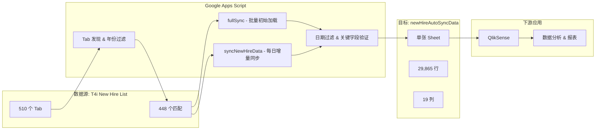

# T4i 新员工数据同步工具

**自动化数据管道：将 T4i 新员工入职追踪表（510 个 Tab）整合为一张干净、可直接加载到 QlikSense 的单表 —— 每天自动更新两次。**

---

## 问题背景

T4i 团队使用一个名为 **T4i New Hire List** 的 Google Spreadsheet 来追踪新员工入职流程。经过多年积累，这个表格已经增长到 **510 个 Tab**（自 2020 年起，每周/每类别一个 Tab），导致：

- 无法获得所有新员工数据的统一视图
- 无法将数据加载到 QlikSense 等分析工具中
- 无法追踪跨时间段的趋势
- 数据质量和一致性难以维护

手动整合数据容易出错、耗时巨大，且在大规模数据下不可持续。

## 解决方案

一个 Google Apps Script 自动化脚本，实现以下功能：

1. 扫描全部 510 个源 Tab，识别哪些包含目标列
2. 提取数据并标准化为一致的 19 列格式
3. 过滤空行/无效行及未来日期的条目
4. 将所有数据写入单张目标表，按 Start Date 排序
5. 通过定时触发器每天自动运行两次

## 架构概览

## 核心功能

| 功能 | 说明 |
|------|------|
| **批量全量同步** | 将全部 448 个匹配 Tab 分批处理（每批 150 个），通过自动续接触发器完成初始数据加载，避免执行超时。 |
| **增量每日同步** | 仅重新处理最近 6 周的 Tab，保留目标表中的历史数据。执行时间 1-2 分钟。 |
| **智能 Tab 识别** | 从 Tab 名称中解析年份（如 "Week of Jan 11 21" → 2021）。跳过早于 `EARLIEST_YEAR` 的 Tab。无法解析年份的 Tab 默认保留处理。 |
| **数据级日期过滤** | 跳过所有可用日期均在未来的行（尚无法操作）。同时过滤日期早于 `EARLIEST_YEAR` 的行。 |
| **关键字段验证** | 要求以下字段至少一项非空：First Name、Last Name、Full Name、Username、Start Date、Ship Date。自动剔除空行/垃圾行。 |
| **重复检测** | 基于 Full Name + Start Date + Hire Type 追踪潜在重复项，在执行日志中报告重复组数。 |
| **来源追踪** | 为每行数据追加 "Source Tab" 列，可溯源至原始源 Tab。 |
| **QlikSense 友好输出** | 冻结表头行、统一日期格式（M/d/yyyy）、单表布局，可直接加载到 QlikSense。 |

## 列定义

目标表包含 19 列，按以下自定义顺序排列：

| # | 列名 | 类型 | 备注 |
|---|------|------|------|
| 1 | Start Date | 日期 (M/d/yyyy) | 主排序键 |
| 2 | Ship Date (t4i use only) | 日期 (M/d/yyyy) | 次排序键 |
| 3 | First Name | 文本 | 关键字段 |
| 4 | Last Name | 文本 | 关键字段 |
| 5 | Full name (do not fill) | 文本 | 关键字段；2024年10月后的 Tab 中缺失 |
| 6 | Username | 文本 | 关键字段 |
| 7 | SNOW Ticket | 文本 | ServiceNow 工单号 |
| 8 | Hire Type | 文本 | 用于重复检测 |
| 9 | Intuit Email | 文本 | 2024年10月后的 Tab 中缺失 |
| 10 | Hardware Type: Coder Mac/PC, Pro Mac/PC | 文本 | 硬件规格 |
| 11 | TA Notes | 文本 | 招聘团队备注 |
| 12 | Tech Notes | 文本 | 技术备注 |
| 13 | Who is working it | 文本 | 负责技术员 |
| 14 | Provisioned by | 文本 | 配置技术员 |
| 15 | Shipped | 文本 | 发货状态 |
| 16 | Asset Tag | 文本 | 硬件资产标签 |
| 17 | Tracking number (laptop/full kit) | 文本 | 物流追踪号 |
| 18 | On Site Location | 文本 | 物理位置 |
| 19 | Source Tab | 文本 | 自动生成：数据来源 Tab 名称 |

## 配置参数

位于 `Code.gs` 顶部：

| 变量 | 默认值 | 说明 |
|------|--------|------|
| `SOURCE_SPREADSHEET_ID` | `1cAlD...ZNwU` | T4i New Hire List 表格 ID |
| `DEST_SPREADSHEET_ID` | `1mt2t...xbw` | newHireAutoSyncData 表格 ID |
| `EARLIEST_YEAR` | `2021` | 仅处理该年份及之后的 Tab/数据 |
| `BATCH_SIZE` | `150` | fullSync 每批处理的 Tab 数量 |
| `LOOKBACK_WEEKS` | `6` | 每日增量同步的回溯周数 |

## 函数参考

| 函数 | 用途 | 使用场景 |
|------|------|----------|
| `fullSync()` | 批量处理从 `EARLIEST_YEAR` 起的所有历史 Tab，自动续接。 | 初始数据加载时运行一次。需要重新加载时先运行 `resetFullSync()`。 |
| `syncNewHireData()` | 增量同步：仅刷新最近 `LOOKBACK_WEEKS` 周的 Tab，保留历史数据。 | 每日自动触发（6am + 8pm ET），也可手动运行。 |
| `discoverTabs()` | 扫描源表所有 Tab，报告哪些匹配目标列。 | 源表新增/删除/重命名 Tab 时运行。 |
| `runSortAndFormat()` | 按 Start Date/Ship Date 排序并格式化日期列。 | 手动编辑数据后需要重新排序时运行。 |
| `cleanupOldData()` | 删除目标表中日期早于 `EARLIEST_YEAR` 的行。 | fullSync 后发现 2021 年前的数据时运行。 |
| `setupDailyTriggers()` | 创建每日定时触发器：美东时间 6am 和 8pm。 | 初始设置后运行一次。 |
| `removeDailyTriggers()` | 仅移除每日同步触发器。 | 暂停自动同步时使用。 |
| `removeTriggers()` | 移除所有项目触发器（每日 + 续接）。 | 紧急停止时使用。 |
| `resetFullSync()` | 清除 Script Properties 中的 fullSync 批次状态。 | 需要从头重新运行 fullSync 时使用。 |

## 性能数据

| 操作 | 耗时 | 备注 |
|------|------|------|
| 全量同步（448 个 Tab） | 约 25-35 分钟 | 每批 150 个 Tab，自动续接 |
| 每日增量同步 | 约 1-2 分钟 | 仅处理约 6-12 个近期 Tab |
| 排序 & 格式化（3 万行） | 约 1.5 秒 | 使用内置 `Range.sort()` |
| 清理旧数据 | 约 30 秒 | 读取、过滤、重写 |
| Tab 发现扫描 | 约 10 分钟 | 读取每个 Tab 的第 2 行表头 |

## 版本历史

| 版本 | 日期 | 变更内容 |
|------|------|----------|
| v1 | 2026-02-12 | 初始实现：全量同步、所有列、基础过滤 |
| v2 | 2026-02-12 | Start Date 移至第 1 列；新增 Source Tab 列；新增重复检测 |
| v3 | 2026-02-12 | 所有注释转为英文 |
| v4 | 2026-02-12 | 修复独立脚本的 `getUi()` 报错；新增 `EARLIEST_YEAR` Tab 名称过滤 |
| v5 | 2026-02-12 | 新增增量同步架构（`fullSync` + `syncNewHireData`）；批量处理自动续接；`LOOKBACK_WEEKS` 每日同步 |
| v6 | 2026-02-12 | 修复排序超时：用 `Range.sort()` 替代 JavaScript 读-排-写；新增数据级日期过滤；新增 `cleanupOldData()` 和 `runSortAndFormat()` |

## 项目数据

- **源表**：T4i New Hire List（510 个 Tab）
- **匹配 Tab 数**：448（2021 年至今）
- **同步总行数**：29,865
- **数据时间范围**：2021 年 1 月 – 2026 年 2 月
- **目标表**：newHireAutoSyncData（单张 Sheet）
- **自动同步计划**：每天美东时间 6:00 AM 和 8:00 PM
- **脚本项目**：[Apps Script 编辑器](https://script.google.com/u/0/home/projects/1A534ez111nKj5FXkJjemVO6wTLjYfXkKfixufoJ4xnFIX3qFc3v1bpN5/edit)

## 链接

- **源表**：[T4i New Hire List](https://docs.google.com/spreadsheets/d/1cAlDPmgQ3mkmC5l5Jw-h6HlDre1RqIenAHVpoulZNwU/edit)
- **目标表**：[newHireAutoSyncData](https://docs.google.com/spreadsheets/d/1mt2tOVCtef0y2vP5_Y53E-wpU2MZN_tKbbfDk7bWxbw/edit)

---

*构建者：Peter Wang | T4i Care East | 2026 年 2 月 12 日*
